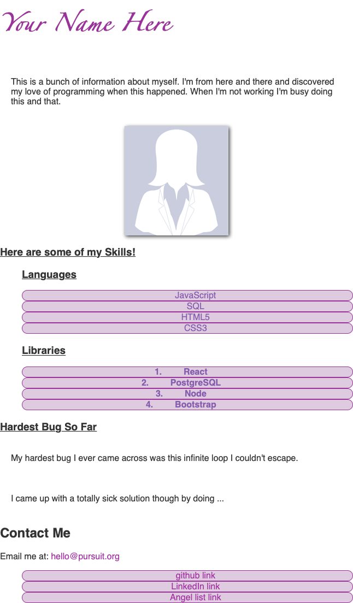

# Introductory CSS Lab

In this lab, you'll have the opportunity to design a personal webpage. The content already exists -- you just need to style it to the best of your ability!

---

## Lab Setup

### Getting started

1. Fork and clone this repository.

1. Navigate to the `settings` tab on GitHub, then choose `Pages` from the menu. Configure the `Build and Deployment` to have a `Source` of `Deploy from a branch` and select the `main` branch for deployment. Deployments can take a few minutes, so get started on the lab, and then be sure to check the deployment after you have made a few commits.

1. Open up the repository in VSCode. Follow the instructions below to complete the Lab.

## Instructions

To complete the tests in this lab, you will need to add the following styles. If you're unclear about any of the instructions below, remember that you can check the test file to see what exactly is being tested.

- Change the font of the name header to be `'Fantasy'` and purple.
- Remove the bullet points from your unordered list of links.
- Change the `font-weight` in your ordered list to bold.
- Center all `li` elements on the page.
- Give your `li` elements a 1px red border with curved corners.
- Change the font color of your `li` elements to blue and the background color to a light pink.
- All images should be 200 pixels tall.
- Change all font in the body to sans-serif.
- Underline all `h3` elements.
- All `p` tags should have 20 pixels of padding on the top and the bottom - not on the sides.
- `h1` tags should have a 30px font size.
- Lists should have `30px` of padding on the left.

After you've completed these tasks, continue styling your page to make it look unique. You should add at least _ten additional declarations_ on top of the ones you've made above.

